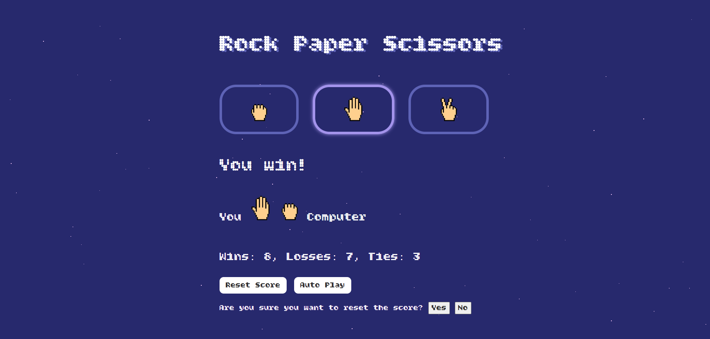

# Rock Paper Scissors Game (with Autoplay & Persistent Score)
A classic Rock Paper Scissors game where you play against the computer. 

A classic Rock Paper Scissors game where you play against the computer.  
This version includes autoplay, keyboard shortcuts, score saving with `localStorage`, and a confirmation popup before resetting the score.

## 🚀 Features

- Play vs. computer (with logic for rock/paper/scissors outcomes)
- **Autoplay mode** – automatic rounds every 1 second
- **Persistent score** using `localStorage` (keeps track of wins, losses, ties)
- **Keyboard controls**:
  - `r`, `p`, `s` for Rock, Paper, Scissors
  - `a` to toggle autoplay
  - `Backspace` to reset score
- **Reset confirmation popup** before clearing score
- Basic responsive design and game UI

## 🛠️ Technologies Used

- HTML
- CSS
- JavaScript:
  - DOM manipulation
  - `setInterval` / `clearInterval`
  - `localStorage`
  - Keyboard event listeners

## 🎮 How to Play

1. Click a button or press `r`, `p`, or `s` to play your move.
2. The computer randomly chooses its move.
3. The game displays the result and updates the score.
4. Press `a` or click "Auto Play" to let the computer play automatically.
5. Press `Backspace` or click "Reset" to clear your score (with confirmation).

## 🖼️ Screenshot

